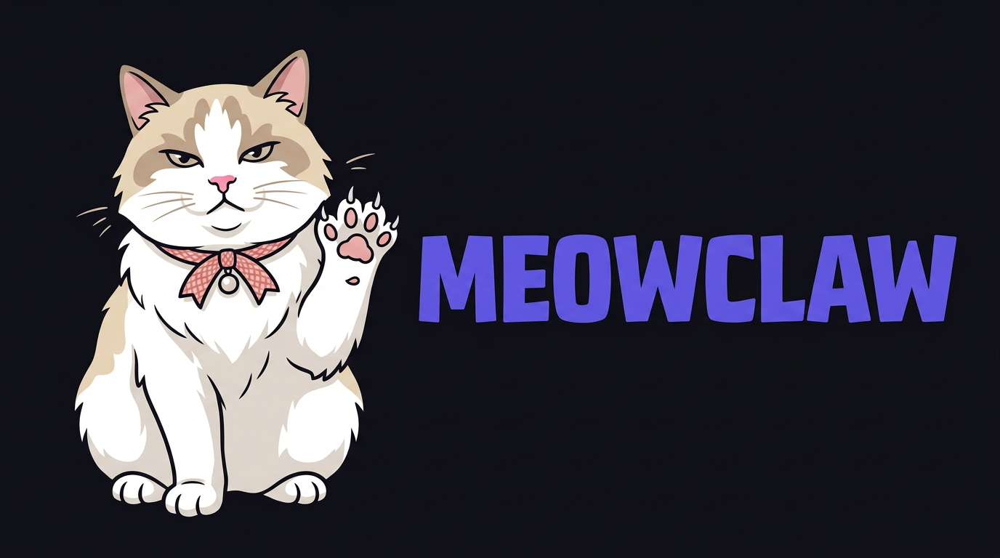

# 🐱 MeowClaw — Lightweight AI Gateway

<p align="center">
  
</p>

<p align="center">
  <strong>A fast, stable, single-binary AI assistant gateway built with Go.</strong>
</p>

<p align="center">
  <em>"What OpenClaw does, in 1/10 the binary size, 10x more stable."</em><br>
  The lobster is big and heavy. The cat is light and sharp. 🐱
</p>

## Why MeowClaw?

| | OpenClaw (Node.js) | MeowClaw (Go) |
|---|---|---|
| Install | `npm install -g` + Node 24 | Single binary, zero deps |
| Binary size | ~200MB+ (node_modules) | ~20MB |
| Memory | 1GB+ | <50MB |
| Stability | Restarts every ~50min | Designed to never crash |
| Setup | Complex JSON config | `meowclaw init` (2 min) |

## Quick Start

```bash
# Install
go install github.com/YoungsoonLee/meowclaw/cmd/meowclaw@latest

# Interactive setup
meowclaw init

# Start
meowclaw up
```

## Features

- **Multi-channel**: Telegram, Discord, WhatsApp (whatsmeow), Slack (Socket Mode), WebChat
- **Multi-provider AI**: OpenAI, Anthropic (extensible)
- **Persistent memory**: SQLite + FTS5 full-text search
- **Streaming responses**: ChatGPT-like real-time token delivery via WebSocket
- **WebSocket API**: Real-time message streaming
- **Web dashboard**: Built-in status & chat UI
- **Single binary**: No runtime dependencies

## Architecture

```
Telegram / Discord / WhatsApp / Slack / WebChat
               |
               v
   +------------------------+
   |   MeowClaw Gateway     |
   |  ws://127.0.0.1:6820  |
   +----------+-------------+
              |
    +---------+---------+
    |                   |
  Agent            WebSocket
  (LLM)           Clients
    |
  Memory
  (SQLite)
```

## Configuration

Config lives at `~/.meowclaw/config.yaml`. See `config.example.yaml` for all options.

```yaml
gateway:
  port: 6820

channels:
  telegram:
    enabled: true
    bot_token: "YOUR_TOKEN"

agent:
  provider: openai
  openai:
    api_key: "sk-..."
```

## CLI Commands

```bash
meowclaw init          # Interactive setup wizard
meowclaw up            # Start the gateway
meowclaw up -v         # Start with verbose logging
meowclaw status        # Check gateway health
meowclaw send --channel telegram --to CHAT_ID -m "Hello"
```

## API

### Health
```
GET /api/health
```

### Send Message
```
POST /api/send
{"channel": "telegram", "to": "123456", "text": "Hello"}
```

### WebSocket
```
ws://127.0.0.1:6820/ws

// Send
{"action": "send", "payload": {"channel": "webchat", "to": "...", "text": "..."}}

// Receive events
{"type": "message.received", "payload": {...}}
{"type": "agent.stream", "payload": {"delta": "Hello", "session_id": "...", "message_id": "..."}}
{"type": "agent.stream.end", "payload": {"session_id": "...", "message_id": "..."}}
{"type": "agent.response", "payload": {...}}
{"type": "channel.online", "payload": {...}}
```

## Building

```bash
# Development build
go build -o meowclaw ./cmd/meowclaw

# Production build (with FTS5 + stripped symbols, ~20MB)
make build
```

## Project Structure

```
meowclaw/                          2,413 lines of Go across 15 files
├── cmd/meowclaw/main.go          -- CLI entry point (init, up, status, send)
├── internal/
│   ├── gateway/
│   │   ├── gateway.go            -- HTTP + WebSocket gateway server
│   │   ├── hub.go                -- Client management + message routing
│   │   └── client.go             -- WebSocket client with ping/pong keepalive
│   ├── channel/
│   │   ├── channel.go            -- Channel interface (Start/Stop/Send/Receive/Health)
│   │   ├── telegram/telegram.go  -- Telegram bridge (go-telegram-bot-api)
│   │   ├── discord/discord.go    -- Discord bridge (discordgo)
│   │   ├── whatsapp/whatsapp.go  -- WhatsApp bridge (whatsmeow, Go-native)
│   │   ├── slack/slack.go        -- Slack bridge (slack-go, Socket Mode)
│   │   └── webchat/webchat.go    -- Built-in WebChat pass-through
│   ├── agent/
│   │   ├── agent.go              -- LLM agent runtime with session management
│   │   └── provider/
│   │       ├── provider.go       -- Provider interface
│   │       ├── openai.go         -- OpenAI ChatCompletion API
│   │       └── anthropic.go      -- Anthropic Messages API
│   ├── memory/memory.go          -- SQLite + FTS5 persistent memory & search
│   ├── config/config.go          -- YAML config loader
│   └── message/message.go        -- Unified message types & event constants
├── web/static/index.html         -- Dashboard UI (dark theme, real-time stats)
├── Makefile                      -- build / run / test / install
├── config.example.yaml
└── .gitignore
```

## Key Advantages over OpenClaw

| | OpenClaw | MeowClaw |
|---|---|---|
| Binary | npm + Node 24 (~200MB+) | **20MB single binary** |
| Install | `npm install -g` + complex config | `make build` + `meowclaw init` |
| WhatsApp | Baileys (JS, unstable, no keepalive) | **whatsmeow (Go-native, built-in keepalive)** |
| Memory | Sessions are ephemeral | **SQLite + FTS5 full-text search** |
| Stability | Restarts every ~50min, OOM crashes | Goroutine isolation, stable memory |
| Slack | Not supported | **Socket Mode (no public URL needed)** |
| AI Providers | Primarily OpenAI | **OpenAI + Anthropic (extensible)** |

### WhatsApp Stability

OpenClaw's #1 user complaint is WhatsApp disconnects ([#4686](https://github.com/openclaw/openclaw/issues/4686)).
Root causes identified by the community:

1. **No presence keepalives** — WhatsApp kills idle sessions after ~24h
2. **Single-file credential backup** — corrupt on restart = session lost
3. **Blind reconnection** — all disconnect reasons treated the same

MeowClaw addresses all three:

- **whatsmeow** (Go-native WhatsApp client) instead of Baileys (JS reverse-engineering)
- **4-minute keepalive pings** to prevent session timeout
- **SQLite WAL-mode credential storage** with proper journal for crash safety
- **Per-channel goroutine isolation** — one channel crash never takes down the gateway

## Roadmap

### v0.2 — Stability & Core Channels
- [x] Slack channel bridge (`slack-go`) ✅
- [x] Streaming responses (chunked WebSocket delivery) ✅
- [ ] Chat commands: `/new`, `/reset`, `/status`, `/model`
- [ ] Auto-reconnect with backoff for all channels
- [ ] Dockerfile + Docker Compose for one-command deploy
- [ ] Goreleaser for cross-platform binaries (Linux/macOS/Windows)

### v0.3 — More Providers & Automation
- [ ] Gemini API provider (Google)
- [ ] Ollama / local model support (run without cloud API keys)
- [ ] Cron / scheduled messages
- [ ] Webhook inbound (receive events from external services)
- [ ] Rate limiting per session
- [ ] DM pairing & allowlist (security, like OpenClaw's pairing system)

### v0.4 — Multi-user & Persistence
- [ ] Multi-user role-based access control (RBAC)
- [ ] Session compaction (summarize long conversations to save tokens)
- [ ] Vector embedding search for memory (semantic recall)
- [ ] Export/import conversation history (JSON, Markdown)
- [ ] Per-channel message chunking (long messages split for Telegram/Discord limits)

### v1.0 — Product
- [ ] Skill / plugin system (load `.so` or WASM extensions)
- [ ] MeowClaw Cloud — managed hosting service
- [ ] Tailscale Serve/Funnel support for remote access
- [ ] Control UI with session management & cost tracking
- [ ] i18n (Korean, Japanese, Chinese, German)
- [ ] `meowclaw doctor` — self-diagnosis tool

## Why "MeowClaw"?

Built on top of **whatsmeow**, the Go-native WhatsApp library.
OpenClaw is a lobster — big, heavy, complex.
MeowClaw is a cat — light, agile, and survives anything. 🐱

## Contributing

AI/vibe-coded PRs welcome!

## License

MIT
